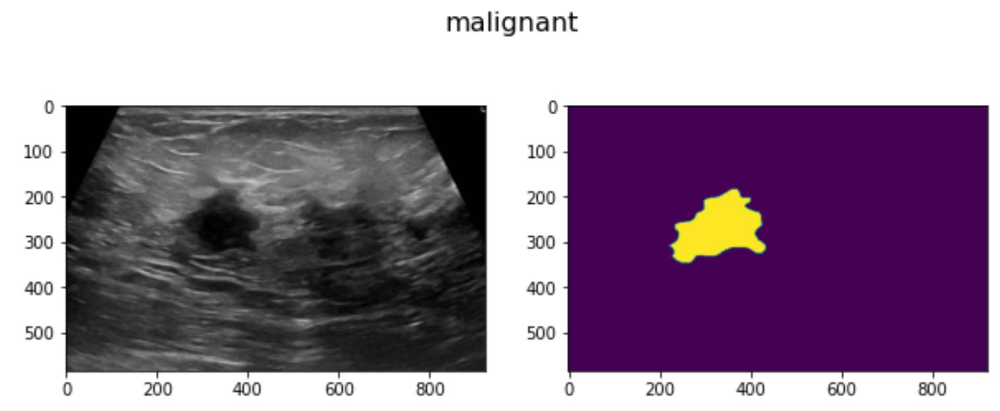
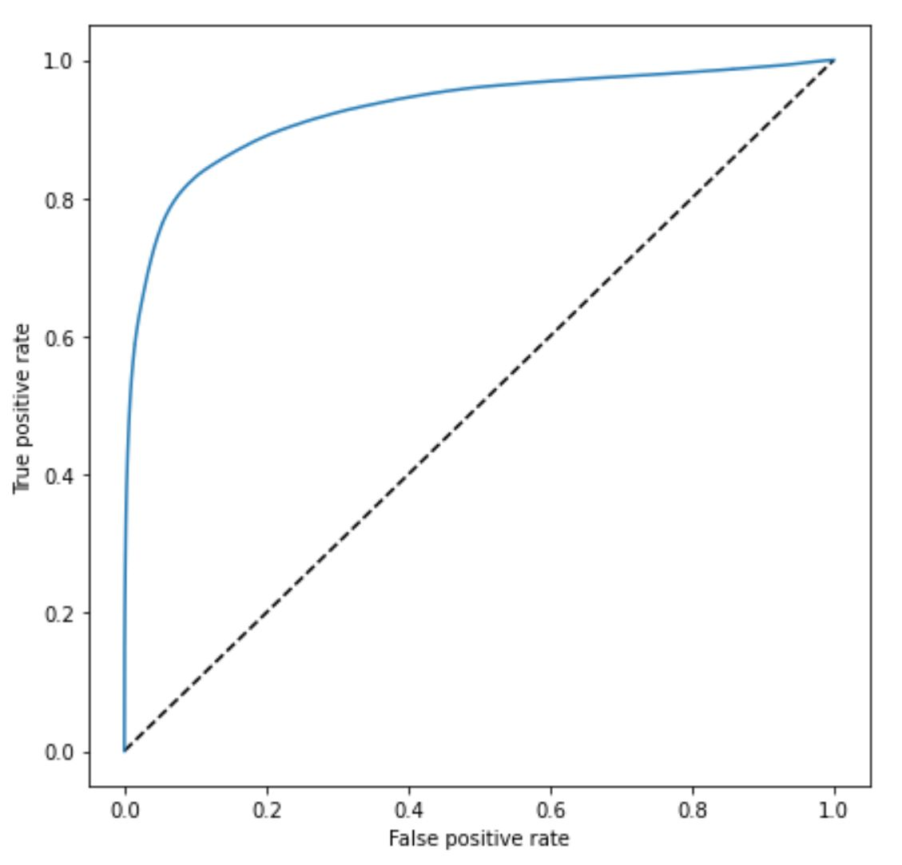

# Breast Cancer Detection with ROC Curve

## Overview


This project focuses on breast cancer detection using a Convolutional Neural Network (CNN). The dataset utilized is the Breast Ultrasound Images Dataset, which includes benign, malignant, and normal breast ultrasound images. The model is trained to segment and classify tumors, providing valuable information for breast cancer diagnosis.

## Getting Started

To run this project, follow the steps below:

Clone the repository:

   ```
   git clone <repository-url>
   cd <repository-folder>
   ```

Install the required dependencies:

```
pip install -r requirements.txt
```


Run the Jupyter Notebook:

```
jupyter notebook Breast_Cancer_(with_ROC).ipynb
```
    

## Dataset:

The Breast Ultrasound Images Dataset is downloaded from Kaggle, containing images categorized into three classes: benign, malignant, and normal. The dataset is preprocessed to exclude normal images for segmentation and classification purposes.

Model Architecture:

The CNN model architecture is designed for image segmentation. It consists of encoder and decoder blocks with skip connections, aiming to capture hierarchical features. The model is compiled using the Adam optimizer and soft dice loss function.

## Training:

The model is trained for 50 epochs on the training set, and the training history is visualized using accuracy and loss plots.

```
history = model.fit(X_train, y_train, epochs=50, validation_data=(X_test, y_test))
```


## Model Evaluation:

The trained model is evaluated on the test set, and metrics such as sensitivity, specificity, accuracy, positive predictive value (PPV), and negative predictive value (NPV) are computed for individual images and overall.

## ROC Curve:



The Receiver Operating Characteristic (ROC) curve is plotted to evaluate the model's performance. It provides a graphical representation of the trade-off between true positive rate and false positive rate at various threshold settings.

```
plot_roc_curve(y_test, y_predicted_prob)
```

## Results:

The project concludes with a detailed analysis of the model's performance, including metrics for individual images and the overall dataset. The ROC curve visually represents the model's ability to discriminate between classes.

Feel free to explore the Jupyter Notebook for a comprehensive understanding of the breast cancer detection process.